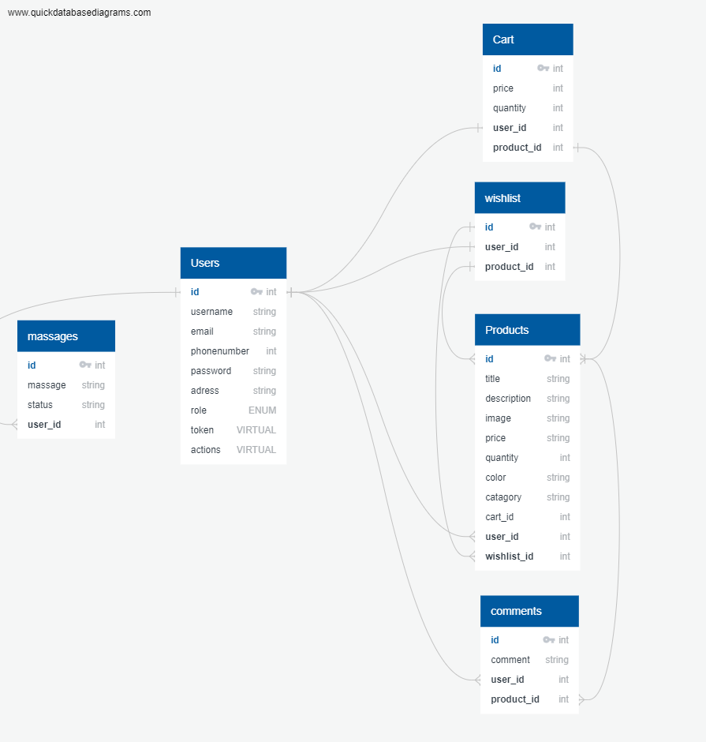

# sooqna-shop-server

## [Server Link](https://agents-shop.herokuapp.com/)

## Dependencies Used

    "base-64": "^1.0.0",
    "bcrypt": "^5.0.1",
    "cors": "^2.8.5",
    "dotenv": "^16.0.1",
    "express": "^4.18.1",
    "jest": "^28.1.3",
    "jsonwebtoken": "^8.5.1",
    "morgan": "^1.10.0",
    "pg": "^8.7.3",
    "sequelize": "^6.21.3",
    "sequelize-cli": "^6.4.1",
    "socket.io": "^4.5.1",
    "socket.io-client": "^4.5.1",
    "sqlite3": "^5.0.10",
    "supertest": "^6.2.4

## Installation

**Sooqna** requires Node.js v16+ to run.

Install the dependencies and devDependencies and start the server.

```js
cd agents-cloud-server
npm i
nodemon
```

## AUTH ROUTES

<br>

| **Path** | **Method** | **Response and Usage**              | **Who is can access this page** |
|----------|------------|-------------------------------------|---------------------------------|
| /signup  | post       | to create a user                    | any user                        |
| /signin  | post       | to login a user and receive a token | any user saved in the data base |

<br>

## Product ROUTES

<br>

| **Path**     | **Method** | **Response and Usage** | **who is can access this page**    |
|--------------|------------|------------------------|------------------------------------|
| /product     | get        | Get All Products       | User Who (Own/Sell) these Products |
| /product/:id | get        | Get One Product        | User Who (Own/Sell) these Products |
| /product     | post       | Create A Product       | User Who (Own/Sell) these Products |
| /product/:id | put        | Update A Product       | User Who (Own/Sell) these Products |
| /product/:id | delete     | Delete One Product     | User Who (Own/Sell) these Products |
| /product     | delete     | Delete All Products    | User Who (Own/Sell) these Products |

<br>

## Wishlist ROUTES

<br>

| **Path**      | **Method** | **Response and Usage** | **Who is can access this page** |
|---------------|------------|------------------------|---------------------------------|
| /wishlist     | get        | Get All Wishlists      | User Who is signed in           |
| /wishlist/:id | delete     | Delete One Wishlist    | User Who is signed in           |
| /wishlist     | delete     | Delete All Wishlists   | User Who is signed in           |

<br>

## Cart ROUTES

<br>

| **Path**  | **Method** | **Response and Usage** | **Who is can access this page** |
|-----------|------------|------------------------|---------------------------------|
| /cart     | get        | Get All Cart           | User Who is signed in           |
| /cart/:id | delete     | Delete One Cart        | User Who is signed in           |
| /cart     | delete     | Delete All in Cart     | User Who is signed in           |

<br>

## Database Schema Diagram



